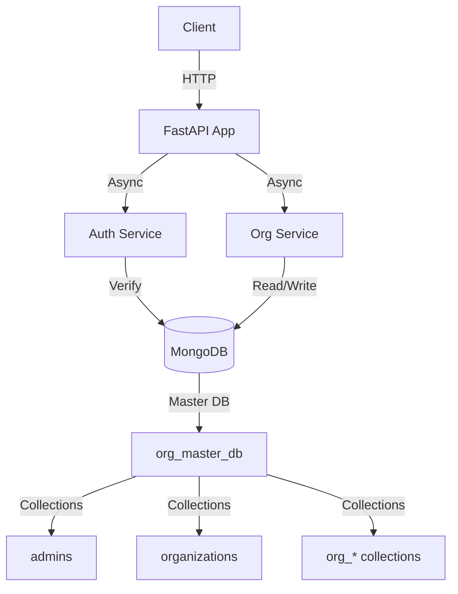

# Organization Management Service

A FastAPI-based backend service for managing organizations with MongoDB. Each organization gets its own collection, and admins are authenticated via JWT tokens.

## Features

- Organization creation with admin user
- JWT-based authentication
- Per-organization MongoDB collections
- Secure password hashing with bcrypt
- Async/await throughout using Motor
- RESTful API design

## Tech Stack

- **Python 3.10+**
- **FastAPI** - Modern web framework
- **Motor** - Async MongoDB driver
- **Pydantic** - Data validation
- **PyJWT** - JWT token handling
- **passlib[bcrypt]** - Password hashing
- **pytest** - Testing framework

## Setup

### Prerequisites

- Python 3.10 or higher
- MongoDB instance (local or remote)

### Installation

1. Clone the repository:
```bash
git clone <repository-url>
cd Organization-Management-Service
```

2. Create a virtual environment:
```bash
python -m venv venv
source venv/bin/activate  # On Windows: venv\Scripts\activate
```

3. Install dependencies:
```bash
pip install -r requirements.txt
```

4. Create `.env` file from `.env.example`:
```bash
cp .env.example .env
```

5. Edit `.env` with your configuration:
```
MONGO_URI=mongodb://localhost:27017
JWT_SECRET=your-secret-key-change-in-production
JWT_ALGORITHM=HS256
JWT_EXP_MINUTES=60
APP_NAME=Organization Management Service
```

### Running the Application

```bash
# Development mode with auto-reload
python -m app.main

# Or using uvicorn directly
uvicorn app.main:app --reload --host 0.0.0.0 --port 8000
```

The API will be available at `http://localhost:8000`

API documentation (Swagger UI): `http://localhost:8000/docs`
Alternative docs (ReDoc): `http://localhost:8000/redoc`

## API Endpoints

### Organization Management

#### Create Organization
```bash
POST /org/create
Content-Type: application/json

{
  "organization_name": "Acme Corp",
  "email": "admin@acme.com",
  "password": "securepass123"
}
```

#### Get Organization
```bash
GET /org/{organization_name}
```

#### Update Organization
```bash
PUT /org/{organization_name}
Authorization: Bearer <token>
Content-Type: application/json

{
  "new_organization_name": "Acme Corporation",
  "email": "newadmin@acme.com",
  "password": "newpassword123"
}
```

#### Delete Organization
```bash
DELETE /org/{organization_name}
Authorization: Bearer <token>
```

### Authentication

#### Admin Login
```bash
POST /admin/login
Content-Type: application/json

{
  "email": "admin@acme.com",
  "password": "securepass123"
}
```

Response includes JWT token:
```json
{
  "access_token": "eyJ...",
  "token_type": "bearer",
  "admin": {
    "admin_id": "...",
    "email": "admin@acme.com",
    "organization_name": "Acme Corp",
    "org_collection": "org_acme_corp",
    "created_at": "2024-01-01T00:00:00"
  }
}
```

## Architecture



## Database Structure

### Master Database: `org_master_db`

#### Collections:
- **`admins`**: Admin user accounts
  - `_id`: ObjectId
  - `email`: string
  - `hashed_password`: string
  - `organization_name`: string
  - `org_collection`: string
  - `created_at`: datetime

- **`organizations`**: Organization metadata
  - `_id`: ObjectId
  - `organization_name`: string
  - `collection_name`: string (e.g., `org_acme_corp`)
  - `admin_id`: ObjectId (reference to admins)
  - `admin_email`: string
  - `created_at`: datetime

- **`org_<normalized_name>`**: Per-organization collections
  - Contains organization-specific data
  - Created dynamically when organization is created

## Testing

Run tests with pytest:

```bash
pytest tests/ -v
```

Make sure to set `MONGO_URI` in your `.env` to point to a test database.

## Docker

### Using Docker Compose

```bash
docker-compose up -d
```

This will start:
- MongoDB on port 27017
- FastAPI application on port 8000

### Using Dockerfile

```bash
docker build -t org-management-service .
docker run -p 8000:8000 --env-file .env org-management-service
```

## Security Notes

- Passwords are hashed using bcrypt (via passlib)
- JWT tokens expire after configured minutes (default: 60)
- Only organization admins can update/delete their organizations
- All sensitive operations require authentication
- Never expose hashed passwords in API responses

## Environment Variables

| Variable | Description | Default |
|----------|-------------|---------|
| `MONGO_URI` | MongoDB connection string | Required |
| `JWT_SECRET` | Secret key for JWT signing | Required |
| `JWT_ALGORITHM` | JWT algorithm | `HS256` |
| `JWT_EXP_MINUTES` | Token expiration in minutes | `60` |
| `APP_NAME` | Application name | `Organization Management Service` |

## License

[Your License Here]
