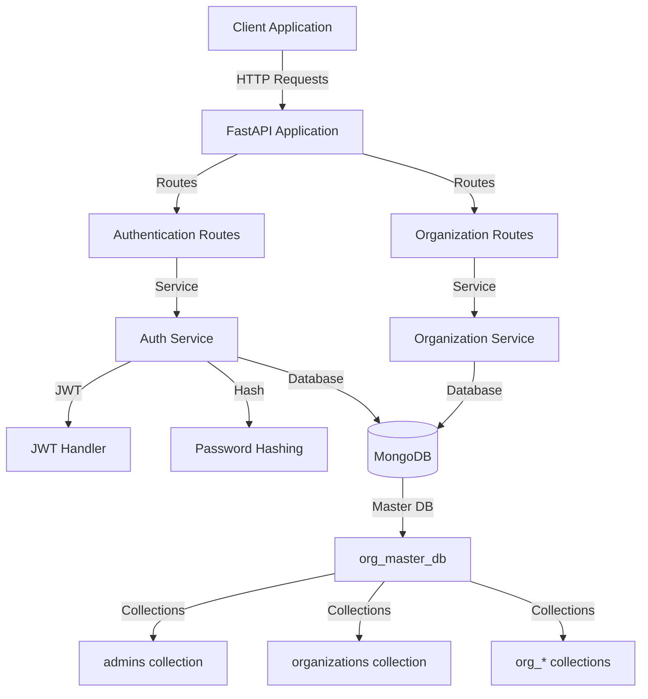

# Organization Management Service

**GitHub Repository:** [https://github.com/codersudharshan/Organization-Management-Service-]

A FastAPI-based backend service for managing organizations with MongoDB. Each organization is assigned its own database collection, and administrators are authenticated using JWT tokens. The application follows a class-based design pattern for modularity and maintainability.

## Features

- Organization CRUD operations with admin user management
- JWT-based authentication and authorization
- Per-organization MongoDB collections for data isolation
- Secure password hashing with bcrypt
- Async/await architecture using Motor for MongoDB operations
- RESTful API with automatic OpenAPI documentation

## Project Structure

```
Organization-Management-Service/
├── app/
│   ├── main.py              # FastAPI application entry point
│   ├── config.py            # Configuration management
│   ├── database.py          # MongoDB connection utilities
│   ├── models/              # Pydantic data models
│   │   ├── org_model.py
│   │   └── admin_model.py
│   ├── routes/              # API route handlers
│   │   ├── org_routes.py
│   │   ├── auth_routes.py
│   │   └── deps.py          # Authentication dependencies
│   ├── services/            # Business logic layer
│   │   ├── org_service.py
│   │   └── auth_service.py
│   └── utils/               # Utility functions
│       ├── hash.py          # Password hashing
│       └── jwt_handler.py   # JWT token management
├── tests/
│   └── test_org_flow.py     # Integration tests
├── requirements.txt
└── .env.example
```

## Setup & Run

### Prerequisites
- Python 3.10+
- MongoDB instance

### Installation

1. Create virtual environment and install dependencies:
```bash
python -m venv venv
source venv/bin/activate  # Windows: venv\Scripts\activate
pip install -r requirements.txt
```

2. Configure environment variables:
```bash
cp .env.example .env
```

Edit `.env`:
```
MONGO_URI=mongodb://localhost:27017
JWT_SECRET=your-secret-key
JWT_ALGORITHM=HS256
JWT_EXP_MINUTES=60
APP_NAME=Organization Management Service
```

3. Run the application:
```bash
python -m uvicorn app.main:app --reload --host 0.0.0.0 --port 8000
```

The API will be available at `http://localhost:8000`  
API documentation: `http://localhost:8000/docs`

## Architecture



## Design Choices

- **Class-Based Architecture**: Services (`OrganizationService`, `AuthService`) and routes are implemented as classes, promoting modularity, testability, and maintainability
- **Lazy Motor Import**: Motor (async MongoDB driver) is imported only during database connection to avoid import-time compatibility issues with pymongo versions
- **Per-Organization Collections**: Each organization gets its own MongoDB collection (`org_<normalized_name>`) for data isolation and scalability
- **Service Layer Pattern**: Business logic is encapsulated in service classes, keeping routes thin and focused on HTTP handling
- **HTTPBearer Security**: Swagger UI uses HTTPBearer scheme for JWT token authentication, providing a clean single-field token input

## API Usage Example

### 1. Create Organization
```bash
POST /org/create
Content-Type: application/json

{
  "organization_name": "Acme Corp",
  "email": "admin@acme.com",
  "password": "securepass123"
}
```

### 2. Login to Get JWT Token
```bash
POST /admin/login
Content-Type: application/json

{
  "email": "admin@acme.com",
  "password": "securepass123"
}
```

Response:
```json
{
  "access_token": "eyJhbGciOiJIUzI1NiIsInR5cCI6IkpXVCJ9...",
  "token_type": "bearer",
  "admin": {
    "admin_id": "...",
    "email": "admin@acme.com",
    "organization_name": "Acme Corp",
    "org_collection": "org_acme_corp"
  }
}
```

Use the `access_token` in the Authorization header for protected endpoints:
```
Authorization: Bearer <access_token>
```

## Submission Summary

This project implements a complete organization management backend service with the following key components:

- **FastAPI** application with async MongoDB operations using Motor
- **JWT-based authentication** with HTTPBearer security scheme for Swagger UI
- **Per-organization data isolation** through dynamic MongoDB collections
- **RESTful API** with automatic OpenAPI/Swagger documentation
- **Service-oriented architecture** with clear separation of concerns
- **Secure password handling** using bcrypt hashing
- **Comprehensive error handling** with appropriate HTTP status codes

The service supports full CRUD operations for organizations, with authentication required for update and delete operations. All endpoints are documented and testable through the Swagger UI interface.
